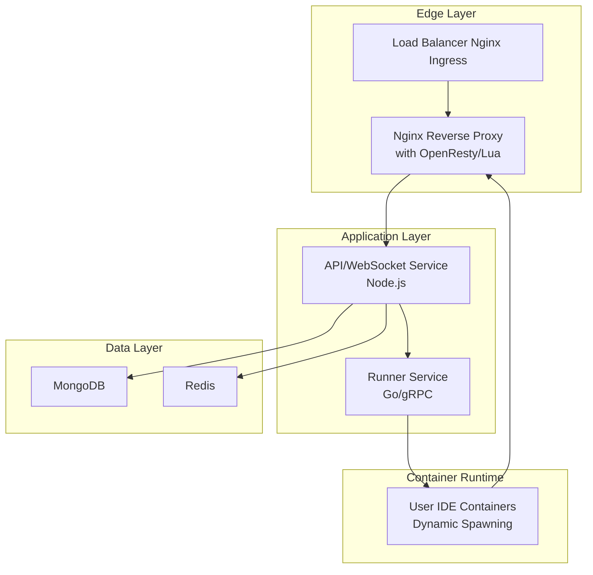

# IDEServer - Cloud IDE Platform

A cloud-based development environment platform that provides dynamic containerized IDE instances with real-time collaboration capabilities.

## 🏗️ Architecture Overview

IDEServer is built on a microservices architecture running on Kubernetes, featuring dynamic routing, WebSocket communication, and container orchestration.



## Tech Stack

### Core Technologies
- **Kubernetes**: Container orchestration and management
- **Nginx + OpenResty**: Reverse proxy with Lua scripting for dynamic routing
- **Docker**: Container image building and management
- **gRPC**: Inter-service communication
- **WebSocket/Express**: Real-time communication and APIs
- **Databases**: MongoDB (will use Redis for cache in future)

### Services
- **API Service**: Node.js backend handling HTTP requests/WebSockets and business logic
- **Runner Service**: Go service managing container lifecycle via gRPC to connect Express and Go client to communicate with Kubernetes
- **Frontend (React.js)**: For users to select images, create sandboxed environments, and use the editor with live testing links in the browser

## Project Structure

```
ideserver/
├── src/
│   ├── apiservice/          # Node.js API backend
│   │   ├── Others/
│   │   │   └── wsHandler.js # WebSocket implementation
│   │   └── ...
│   └── runnerservice/       # Go gRPC service
│       ├── genproto/        # Generated gRPC code
│       └── ...
├── otherconfig/
│   ├── nginx-wildcard.yaml  # Nginx + OpenResty configuration
│   ├── openrusty.sh         # Legacy Nginx configuration
│   └── ...
├── k8s/                     # Kubernetes manifests
├── Learning.md              # Development notes and concepts
└── README.md
```

## Development Setup

### Prerequisites
- Kubernetes cluster (minikube for local development)
- Docker installed and running
- Node.js
- Go
- MongoDB instance
- A domain name to execute live sandboxed environments

### Local Development

1. **Clone the repository**
   ```bash
   git clone <repository-url>
   cd ideserver
   ```

2. **Set up Kubernetes cluster**
   ```bash
   # Using minikube
   minikube start
   ```

3. **Deploy infrastructure**
   ```bash
   # Apply Nginx reverse proxy configuration
   kubectl apply -f otherconfig/nginx-wildcard.yaml
   ```

4. **Install dependencies**
   ```bash
   # API Service
   cd src/apiservice
   npm install
   
   # Runner Service
   cd ../runnerservice
   go mod download
   ```

5. **Generate gRPC code**
   ```bash
   # Use the genproto.sh script
   ./genproto.sh
   ```

## Key Components

### Dynamic Routing System
The Nginx reverse proxy uses OpenResty with Lua scripting to dynamically route requests to user containers based on subdomain patterns:

- Pattern: `{serviceId}-{port}.code.iamanshik.online`
- Example: `abc123-8080.code.iamanshik.online` → routes to service `abc123` on port `8080`

### WebSocket Service
Handles real-time communication for:
- Service status updates
- Container lifecycle events
- User activity polling

### Container Management
- Dynamic container spawning based on user requests
- Automatic cleanup and resource management
- Integration with Kubernetes for orchestration

## Contributing

### Development Workflow
1. Fork the repository
2. Create a feature branch: `git checkout -b feature/amazing-feature`
3. Make your changes and test locally
4. Commit your changes: `git commit -m 'Add amazing feature'`
5. Push to the branch: `git push origin feature/amazing-feature`
6. Open a Pull Request

### Code Style
- Follow Go conventions for Go code
- Use ESLint configuration for JavaScript/Node.js
- Write meaningful commit messages
- Add tests for new features

### Testing
```bash
# Run API service tests
cd src/apiservice
npm test

# Run Runner service tests
cd src/runnerservice
go test ./...
```

## Troubleshooting

### Common Issues
- **Container spawning failures**: Check Kubernetes pod logs and resource limits
- **WebSocket connection issues**: Verify CORS configuration and JWT tokens
- **Routing problems**: Check Nginx configuration and DNS resolution

### Debugging Commands
```bash
# Check pod status
kubectl get pods -n default

# View Nginx logs
kubectl logs -f deployment/nginx-reverse-proxy

# Check service endpoints
kubectl get endpoints
```

## 🙏 Acknowledgments

- OpenResty team for the excellent Nginx distribution
- Kubernetes community for container orchestration

---
